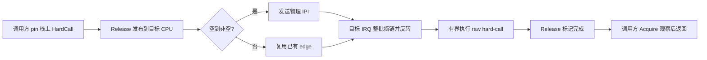
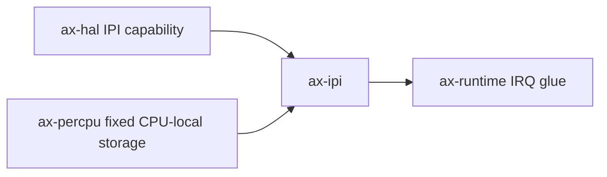

# `ax-ipi`

> 路径：`os/arceos/modules/axipi`
> 类型：库 crate
> 分层：ArceOS 层 / 硬中断跨 CPU 调用基础件
> 版本：`0.5.29`
> 文档依据：`Cargo.toml`、`src/lib.rs`、`src/hard_call.rs`

`ax-ipi` 只提供同步、不可睡眠的跨 CPU hard-call。它对应 Linux
`smp_call_function_single()` 的 CSD 传输边界，不是通用闭包执行器、任务 work queue、
scheduler doorbell 或跨核 RPC。

## 架构设计

### 职责边界

一条 hard-call 只包含：

- 调用方栈上固定地址的 `HardCall` 节点；
- 一个 `unsafe fn(*mut ())` 函数指针；
- 一个只借用到同步调用返回的裸参数；
- 发布状态、单向链指针和完成状态。

目标 CPU 的硬中断不得取得堆对象所有权，不得分配，不得析构 `Box`/`Arc`，也不得
运行任意 Rust 闭包。需要睡眠、分配、持有 OS 对象或执行无界工作的请求必须投递给
任务上下文 worker；scheduler reschedule 则使用 `ax-task` 自己的 generation-bearing
doorbell，不能借用 hard-call 队列。

### 队列所有权

每个 CPU 有一个固定地址的 `HardCallQueue`：

- 多个 producer 只通过原子 compare-exchange 发布节点；
- producer 把队列从空变为非空时取得物理 IPI edge 所有权；
- 唯一 consumer 是目标 CPU 的不可重入 IPI handler；
- consumer 用一次原子 swap 整批摘链，再反转为 FIFO，等价于 Linux CSD 的
  `llist_del_all()` + `llist_reverse_order()`；
- 单次 IRQ 最多处理 64 项；剩余项保存在 owner-only pending 链，并给本 CPU 重新触发
  IPI，禁止在硬中断中无界 drain。

整批摘链避免逐节点 Treiber pop 的 ABA 窗口。consumer 已摘下的旧请求始终先于 IRQ
期间新发布的请求执行。

### 同步生命周期

请求一旦发布，`call_on_cpu()` 就不能超时退出或放弃栈节点；它必须等目标 CPU 标记
完成。否则目标 IRQ 以后解引用该节点会形成 use-after-return。调用方还必须保证目标
函数终止，且不会等待由调用 CPU 或关闭 IRQ 的 CPU 推进的资源。

## 公开接口

- `init()`：验证当前 CPU 的固定 per-CPU queue 已可访问。
- `mark_current_cpu_ready()`：在 IPI handler 安装且本地 IRQ 可用后发布接收能力。
- `is_cpu_ready()` / `wait_until_cpu_ready()`：为启动期页表同步提供 readiness 边界。
- `call_on_cpu()`：同步执行一个类型受限的 raw hard-call。
- `ipi_handler()`：在目标 CPU 硬中断中处理一个有界批次。

旧的 `Callback`、`MulticastCallback`、`run_on_cpu()` 和 `run_on_each_cpu()` 已删除，
不提供兼容层。需要广播的调用方应在任务上下文逐 CPU 调用明确的 typed operation；
需要停止所有 CPU 的内核文本修改由 per-CPU stopper task 完成。

## 依赖关系

`ax-ipi` 不依赖 allocator、`ax-kspin` 或 `ax-lazyinit`。队列在 per-CPU 区域中静态
构造，启动过程只发布 readiness。

## 开发约束

1. `call_on_cpu()` 的参数生命周期必须覆盖完整同步等待。
2. hard-call 不能睡眠、分配、fault，也不能取得可能由调用 CPU 持有的锁。
3. producer 必须先发布 payload，再发送 IPI；handler 必须先取得整批所有权，再遍历。
4. IRQ budget 不得删除；超过 budget 的 work 必须可靠重新触发，不能依赖下一次偶然 IRQ。
5. 不得重新引入 boxed callback、引用计数析构或远端 `SpinNoIrq<VecDeque<_>>`。
6. CPU hotplug 若进入运行时，必须在 readiness 撤销前阻止新发布并等待已发布请求完成。

## 测试

host 行为测试覆盖：

- 参数不被队列拥有或析构；
- 有界 drain 保留剩余工作；
- 批量摘链后保持 FIFO 发布顺序。

SMP QEMU 还需要覆盖 x86_64、AArch64、RISC-V 和 LoongArch 的远端单播、burst、
启动 readiness 与队列重新触发。LoongArch 的物理发送必须使用 blocking submission，
该位只等待 IPI transport 接受命令，不等待目标 handler 执行。

## 跨项目定位

- ArceOS：为 TLB/cache shootdown 等极短硬操作提供同步 CPU 调用。
- StarryOS：通过 ax-runtime 间接使用；`stop_machine` 使用 task-context stopper，不直接
  投递 hard-call 闭包。
- Axvisor：仅在确实需要 host CPU-local hard operation 时经 HAL capability 使用；设备、
  vCPU 与 timer 工作仍应进入各自 owner worker。
