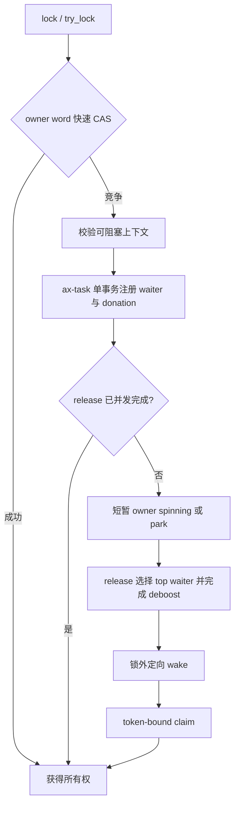

# `ax-sync`

> 路径：`os/arceos/modules/axsync`
> 类型：库 crate
> 分层：ArceOS 同步边界
> 文档依据：`Cargo.toml`、`README.md`、`src/lib.rs`、`src/mutex.rs`

`ax-sync` 明确区分两类互斥语义，不再通过 Cargo feature 暗中改变同一个类型的行为：

- `Mutex<T>` / `SpinMutex<T>` 始终是 `ax_kspin::SpinNoIrq<T>`，用于不能睡眠的短临界区；
- `PiMutex<T>` 是显式选择的、可睡眠的优先级继承互斥锁，仅在 `multitask` feature 下提供。

这种边界让调用方从类型名就能审计“等待时是否允许调度”，也避免启用 feature 后把 IRQ、
早期启动或调度器内部路径意外变成睡眠锁。

## 组件边界

`ax-sync` 负责把 `lock_api` 的安全 guard 接到 ax-task 的 PI 调度协议上，但不复制调度器状态：

- `PiMutexCore` 位于 `ax-task`，唯一拥有 generation-bearing owner word 和有序 waiter tree；
- waiter 的 intrusive linkage 位于被阻塞线程，锁对象不为每个 waiter 分配内存；
- donation graph、deboost、selection 和 handoff 由 `TaskSystem` 事务维护；
- `ax-sync::RawMutex` 只组合 `PiMutexCore`、waiter sequence 和可选 lockdep 状态；
- block 和定向 wake 在调度图与 per-lock metadata gate 全部释放后执行。

硬中断不得访问 PI metadata，也不得获取 `PiMutex`。IRQ 路径应使用原子状态、有界队列、
`IrqWaitCell` 或明确的 raw IRQ gate，把可能睡眠的处理发布到任务上下文。

## API 与 feature

### 始终可用

- `Mutex<T>`：`SpinMutex<T>` 的固定语义别名；
- `MutexGuard<'a, T>`：对应的不可睡眠 guard；
- `SpinMutex<T>` / `SpinMutexGuard<'a, T>`：显式的 IRQ-safe 自旋互斥锁；
- `spin`：完整再导出 `ax-kspin`。

### `multitask`

- `PiMutex<T>` / `PiMutexGuard<'a, T>`：可睡眠的 PI mutex；
- `RawMutex` / `RawPiMutex`：供 `lock_api` 和低层组合使用的 raw PI mutex；
- `LockdepMutexExt`：可选的 subclass 获取接口。

`multitask` 只增加 PI mutex 能力，不改变 `Mutex` 的含义。

## PI mutex 状态机



owner word 的高位表示存在 slow-path 状态。fast unlock 只有在该位未设置时才能直接释放；
一旦 waiter publication 开始，registration、release 与 claim 都经 ax-task 的统一事务完成。
被选择的 waiter 持有 move-only `PiWaitToken`，新的 contender 不能窃取 ownerless handoff。

锁序固定为 `TaskSystem` PI graph state 在前、`PiMutexCore` waiter gate 在后。任何 wake 都在
两者释放后发生，对应 Linux rtmutex 的 `wait_lock` / task PI state 与 `wake_q` 分层。

## 使用方式

普通 IRQ-safe 短临界区：

```rust
use ax_sync::Mutex;

static COUNTER: Mutex<u64> = Mutex::new(0);
```

可能等待、且只在任务上下文使用的共享状态：

```rust
use ax_sync::PiMutex;

static STATE: PiMutex<State> = PiMutex::new(State::new());
```

调用方必须按真实上下文选择锁，不能把 `Mutex` 当作“启用 multitask 后会自动睡眠”的兼容
入口，也不能在硬中断、panic、调度器 gate 或 CPU-offline 临界区获取 `PiMutex`。

## 实现与性能不变量

- uncontended lock/unlock 只操作原子 owner word，不进入全局 PI 图；
- waiter urgency 排序使用锁内 allocation-free AVL tree，cached top 为稳定节点指针；
- owner donor tree 每把已持有锁只保存该锁 top waiter，不扫描 registry；
- `RawMutex` 不保存第二份 owner、selected 或 waiter 容器，当前非 lockdep 布局上限为 64 B；
- owner spinning 只在 owner 未变化、仍在 CPU 上、当前 waiter 仍为 top 且本 CPU 无 resched 时进行；
- guard 为 `GuardNoSend`，避免跨 CPU 转移后破坏 owner identity。

## 测试要求

修改 PI 协议时至少验证：

- fast unlock 与 waiter-bit publication 竞争；
- selection/deboost/ownerless publication 先于 wake；
- ownerless handoff 不被 newcomer 窃取；
- cancellation 与 release 只有一个胜者；
- donation chain、policy rekey、地址复用 generation 与线程退出；
- `RawMutex` 紧凑布局，防止重新把 waiter 容器塞回每个锁对象；
- `ax-sync`、`ax-task` 的 host/loom 测试以及 Starry 主要 feature clippy。

系统级验证还应覆盖 pthread/futex、pipe、进程退出、SMP migration 和高竞争锁路径；成功只能
以正式 QEMU runner 标志为准。
